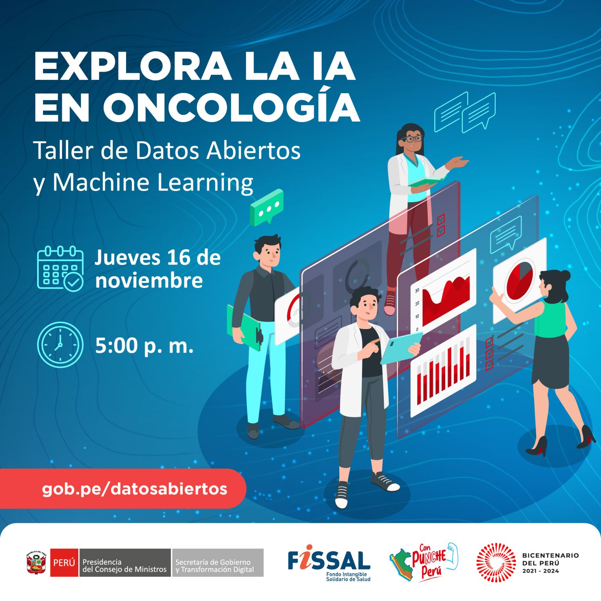

# Explora la IA en Oncologia

La sesión de valor **"Explora la IA en Oncología"**, un taller virtual de Datos Abiertos está diseñada para alcanzar a toda la ciudadanía y fomentar la investigación, fortaleciendo la prevención del cáncer en nuestra sociedad. El propósito de esta sesión es brindarte capacitación en la identificación de patrones relacionados con el cáncer mediante el análisis de datos abiertos.

Durante el evento, los participantes adquirieron conocimientos fundamentales de la Inteligencia Artificial y el Aprendizaje Automático (Machine Learning), aplicando estos conceptos a datos reales de atenciones oncológicas proporcionados por FISSAL. Esta iniciativa busca promover la colaboración y la acción conjunta para abordar de manera efectiva esta problemática de interés nacional.

El evento está organizado por la **Secretaría de Gobierno y Transformación Digital de la Presidencia del Consejo de Ministros** en alianza con el **Fondo Intangible Solidario de Salud FISSAL**.
